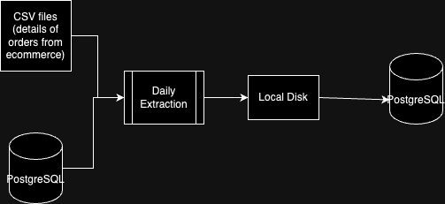

# code-challenge-indicium
## Overview
This project is a case for Indicium's code challenge.
Author: [@fernandostahelin](https://github.com/fernandostahelin)

I opted to use uv as the package manager for this project. It was the first time using it and I liked the simplicity of it.

I also opted to use Ruff instead of Flake8 for linting. Like uv, it was the first experimenting with it. I choosed mostly because of good comments of the community saying how fast it was.

## Architecture



## Credentials
The credentials for the databases are stored in the `.env` file.
Create your own `.env` file by copying the `.env.example` file and filling in the values.
Docker-compose will fetch the values from the `.env` file to configure the databases.
## Setup
First, if you haven't already, install Docker.

Then, run the following command to start the database containers:
```bash
docker compose up -d
```
In this project, we're using Docker to run 2 postgres databases:
- `db-source`: the source database, which contains the Northwind dataset.
- `db-analytics`: the analytics database, which we will be storing the results of our transformations in.

## Querying the databases

To use the psql CLI to query the source database, run the following command:
```bash
docker exec -it code_challenge_indicium-db-source-1 psql -U $POSTGRES_USER_SOURCE $POSTGRES_DB_SOURCE   
```
To query, the logic is the same. Just change the variables to match the analytics database, along with the container name.

```bash
docker exec -it code_challenge_indicium-db-analytics-1 psql -U $POSTGRES_USER_ANALYTICS $POSTGRES_DB_ANALYTICS
```

After connected, you can run queries using the `SELECT` statement. For example:
```sql
SELECT * FROM orders;
```

## Transformations  

